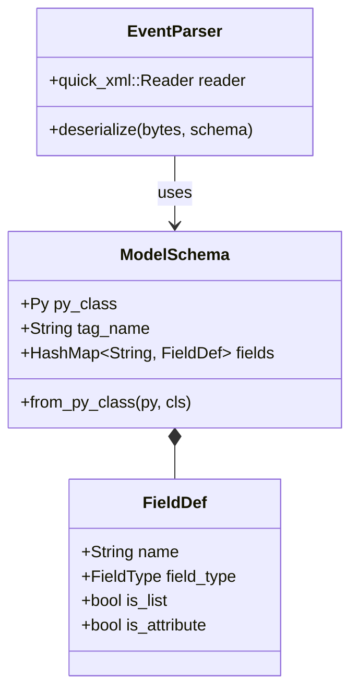

# Architecture & Internal Design

`pyxsdata-core` is architected as a native extension bridge between CPython 3.12+ and Rust. This document outlines the internal data structures, type resolution rules, and execution flow.

---

## High-Level Architecture

The crate is organized into three primary subsystems:

### 1. `schema.rs`: The Schema Registry

When a Python class (`@dataclass` or `pydantic.BaseModel`) is passed to `pyxsdata-core`, `ModelSchema::from_py_class` inspects the class structure:

- **Pydantic v2 Inspection**: Checks for `model_fields` attribute on the class. Reads field annotations, default values, and metadata from `field_info.xsdata_metadata` or `field_info.json_schema_extra`.
- **Standard Dataclass Inspection**: Reads `__dataclass_fields__`, extracting field names, types from `typing.get_type_hints()`, and metadata dictionaries.
- **PEP 563 & PEP 695 Support**: Evaluates stringified annotations (`from __future__ import annotations`) within the module's global namespace.
- **Recursive Sub-schemas**: When a nested model type is encountered, a child `ModelSchema` is recursively built and linked in the schema tree.

### 2. `parser.rs`: The Streaming Pull Parser

`pyxsdata-core` wraps `quick-xml`'s `NsReader` in an iterative state-machine:

- **Namespace Scope Tracking**: `quick-xml` tracks active prefix mappings (`xmlns:foo="urn:bar"`) without allocating Python dicts per element.
- **Tag Matching**: Start tags are matched against field definitions in $O(1)$ time using Rust `FxHashMap` lookups.
- **Text & CDATA Accumulation**: Element text is accumulated into pre-allocated byte buffers.
- **Nested Push-Down**: When a child complex element begins, the parser pushes a new frame onto an internal execution stack, building the child object first.

### 3. PyO3 C-API Object Construction

When an element's closing tag is encountered:

1. Primitives (integers, floats, booleans, strings) are parsed directly in Rust and converted to `PyLong`, `PyFloat`, `PyBool`, or `PyString`.
2. A PyO3 keyword argument dictionary (`PyDict`) is created and populated with the fields.
3. The Python class constructor is called via `py_class.call((), Some(&kwargs))`.
4. The resulting Python object is placed into the parent frame's field collection or returned to Python if at the root.

---

## Memory & Thread Safety

- **GIL Interaction**: The GIL is acquired only when constructing Python objects or reading class attributes. Token parsing and byte scanning in `quick-xml` can be released to run in parallel across threads.
- **Zero-Copy Byte Slices**: Attribute names, attribute values, and tag names are referenced as borrowed slices (`&[u8]`) into the input buffer rather than allocating owned `String` objects.
- **Thread Safety**: `ModelSchema` instances are immutable once constructed and safe to share across concurrent Python threads using free-threaded or GIL-protected workers.
