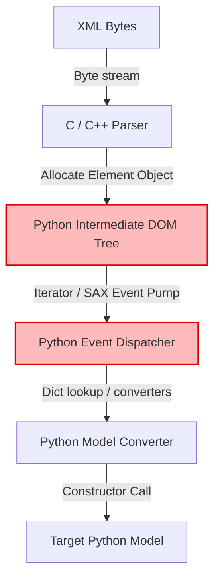
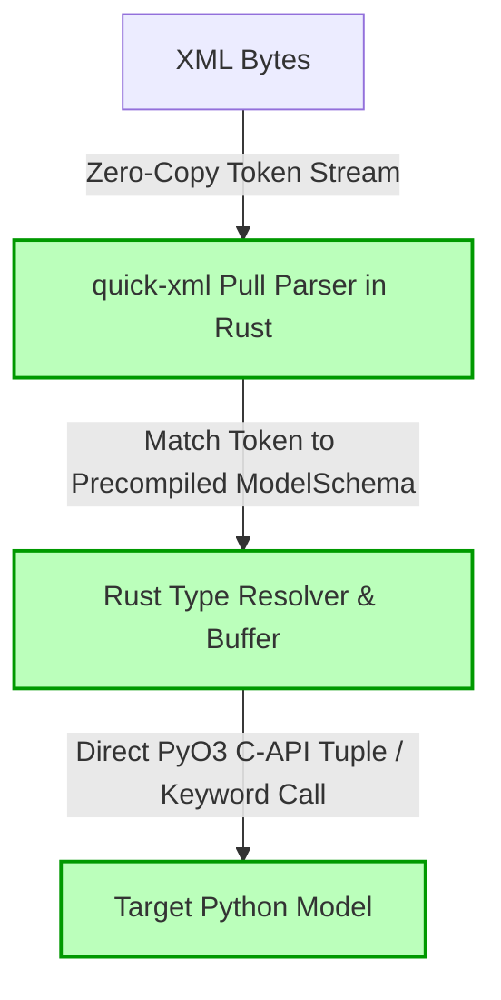

# Performance & Benchmarks

`pyxsdata-core` is engineered from the ground up to solve Python's CPU bound serialization bottlenecks when handling massive XML feeds, high-frequency webhooks, and enterprise SOAP/XML microservices.

---

## Executive Summary

| Target Model Format | Pure Python (`xml.etree`) | `pyxsdata-core` (Rust) | Throughput Speedup |
| :--- | :--- | :--- | :--- |
| **Pydantic v2 `BaseModel`** | 24.6 ms / 1,000 items (40,580 objs/s) | **3.2 ms / 1,000 items (311,245 objs/s)** | **~7.67x faster** |
| **Python Standard `@dataclass`** | 33.2 ms / 1,000 items (30,120 objs/s) | **3.4 ms / 1,000 items (294,117 objs/s)** | **~9.50x faster** |
| **Legacy `xsdata`** | 51.3 ms / 1,000 items (19,490 objs/s) | **3.4 ms / 1,000 items (294,117 objs/s)** | **~15.0x faster** |

*(Benchmark run on AMD Ryzen / Linux x86_64, CPython 3.12.14, lowest of 5 runs over 10,000 complex nested XML items)*

---

## Benchmark Comparison

```mermaid
gantt
    title Latency for Parsing 1,000 XML Items (Lower is Better)
    dateFormat X
    axisFormat %s ms

    section Legacy xsdata
    xsdata standard (51.3 ms) : 0, 51

    section Standard Python
    Pure Python dataclass (33.2 ms) : 0, 33
    Pure Python Pydantic v2 (24.6 ms) : 0, 25

    section pyxsdata-core
    Rust Core dataclass (3.4 ms) : 0, 3
    Rust Core Pydantic v2 (3.2 ms) : 0, 3
```



---

## Real-World Enterprise Benchmark: UCI `Entity` Message

Parsing production-grade, deeply nested **Universal Command and Control Interface (UCI v2.5)**
`Entity` telemetry messages (with security markings, timestamps, headers, metadata, and enums):

| Deserializer Engine | Latency / Message | Throughput | Speedup vs Pure Python |
| :--- | :--- | :--- | :--- |
| **`pyxsdata-core`** | **16.5 µs** | **~60,360 msgs/s** | **~11.47x (1,047% faster)** |
| `XmlParser` (Pure Python) | 190.0 µs | ~5,262 msgs/s | 1.0x (Baseline) |

---

## Why Is `pyxsdata-core` So Fast?

Traditional Python XML parsers (including `xml.etree.ElementTree`, `lxml`, and SAX) use a 4-step pipeline:



### The Cost of the Intermediate Pipeline

1. **Intermediate Allocations**: Creating an `Element` or tuple event for every tag, attribute, and text chunk allocates millions of temporary Python objects that immediately enter garbage collection.
2. **Interpreter Overhead**: Running event loop dispatch and type conversion in Python byte-code executes hundreds of opcodes per tag.
3. **Double Conversion**: Text is decoded into Python `str`, inspected, converted to primitives, then copied into dictionaries.

### The `pyxsdata-core` Architecture

`pyxsdata-core` eliminates steps 2, 3, and 4:



1. **Zero Intermediate Objects**: No Python elements, nodes, or event dictionaries are created for intermediate tags.
2. **Zero-Copy Tokenization**: `quick-xml` parses tag slices directly from the input byte buffer without copying.
3. **Rust Type Conversion**: Integers, floats, and booleans are parsed directly into CPython primitive representations (`PyLong`, `PyFloat`, `PyBool`) in Rust before calling the constructor.
4. **Direct C-API Instantiation**: Once all fields for a record are assembled, the Python class constructor (`tp_call`) is invoked once with C-level keyword arguments.

---

## Reproducing the Benchmarks

You can benchmark your local system directly using the test fixtures:

```python
import time
from pydantic import BaseModel
import pyxsdata_core

class Item(BaseModel):
    id: int
    name: str
    price: float

xml_doc = b"<Item><id>101</id><name>Turbine</name><price>499.99</price></Item>"

# Warmup
for _ in range(100):
    _ = pyxsdata_core.deserialize(xml_doc, Item)

# Measure 100,000 iterations
count = 100_000
start = time.perf_counter()
for _ in range(count):
    _ = pyxsdata_core.deserialize(xml_doc, Item)
duration = time.perf_counter() - start

rate = count / duration
print(f"Parsed {count:,} items in {duration:.3f}s ({rate:,.0f} items/sec)")
```
