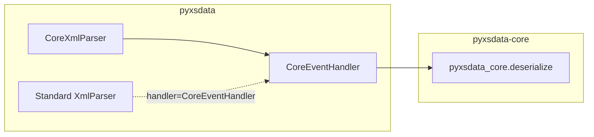

# Integration with pyxsdata

`pyxsdata-core` is the native acceleration backend for [`pyxsdata`](https://github.com/nth-bailey/pyxsdata). This guide explains how the two packages work together.

---

## Architecture of the Integration

`pyxsdata` provides a comprehensive, type-safe data binding toolkit: code generation from XSD/WSDL/JSON Schema, serialization, validation, and multi-backend event dispatch.

When `pyxsdata[core]` is installed, `pyxsdata` exposes two acceleration components:



1. **`CoreEventHandler`**: A custom `XmlHandler` plugin that intercepts parse calls and routes raw XML streams directly into `pyxsdata_core`.
2. **`CoreXmlParser`**: A pre-configured drop-in parser that defaults to `CoreEventHandler`.

---

## Using `CoreXmlParser` with Standard Dataclasses

Import `CoreXmlParser` from `pyxsdata.formats.dataclass.parsers`:

```python
from pyxsdata.formats.dataclass.parsers import CoreXmlParser
from myapp.models import PurchaseOrder  # Standard dataclass generated by pyxsdata

parser = CoreXmlParser()

# Parse from file path, string, or bytes
order = parser.parse("order.xml", PurchaseOrder)
print(order)
```

---

## Using `CoreXmlParser` with Pydantic v2

Import `CoreXmlParser` from `pyxsdata.pydantic`:

```python
from pyxsdata.pydantic import CoreXmlParser
from myapp.models import PurchaseOrder  # Pydantic v2 BaseModel generated by pyxsdata

parser = CoreXmlParser()

# Fast deserialization into validated Pydantic models
order = parser.parse("order.xml", PurchaseOrder)
print(order.model_dump())
```

---

## Automatic Root Tag Resolution

`CoreXmlParser` supports both explicit target class passing and automatic type lookup via `XmlContext`:

```python
from pyxsdata.formats.dataclass.context import XmlContext
from pyxsdata.formats.dataclass.parsers import CoreXmlParser
from myapp.models import Catalog, Invoice

context = XmlContext()
context.find_type("{http://example.com/ns}Catalog")  # Pre-registered

parser = CoreXmlParser(context=context)

# Target class is inferred automatically from the XML root element
document = parser.parse("document.xml")
```

---

## Fallback Behavior

If your application uses `CoreXmlParser` in an environment where `pyxsdata-core` is not installed (e.g. an embedded system or minimal sandbox), `CoreXmlParser` automatically falls back to `default_handler()` (either `LxmlEventHandler` or `NativeEventHandler`) without throwing an `ImportError`.
